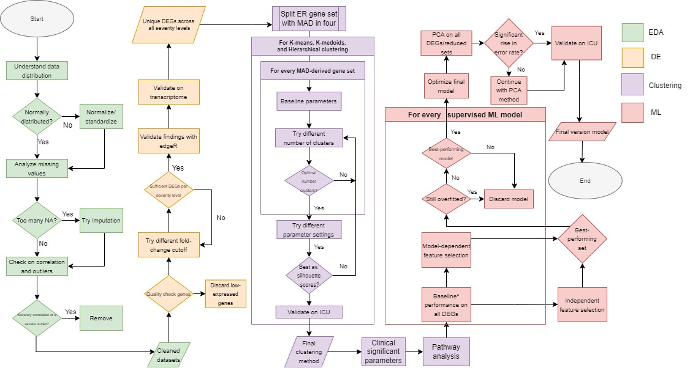

# Unraveling the role of mitochondria dysfunction in early sepsis

This research was conducted by Dennis Scheper (373689)

---

*_Statement on Git commit history:_* The commit history you see here is not complete; most of it was lost due to deletion of a previous repository. I accidentally pushed sensitive data and had to delete the entire previous repository (a `git rm` is not sufficient as the data 'lives' on in the commit history). I tried to restore the commit history in this repository, but to no avail. There is, however, a log history of the previous repository available under `misc/git_history.txt`. I do understand that this may not be sufficient, but it is the best I could do.

# Abstract
Sepsis, a major contributor to in-hospital deaths, is challenging to detect due to its heterogeneous nature. Dysfunctional mitochondria from immune responses can worsen the condition. Analyzing mitochondria-related genes could help in early detection and guide treatment. 
 
RNA-Seq and clinical data from 348 septic patients, originating from four emergency rooms (ER) and one intensive care unit (ICU), were used and compared to 44 healthy controls. Both supervised and unsupervised machine-learning algorithms were applied to identify gene profiles with clinical relevance. 
 
Mitochondria-related differentially expressed genes (DEGs) were identified by comparing levels of severity based on SOFA scores. These DEGs helped establish two unique severity-based on ER cohorts (‘endotypes’), distinct from healthy controls and validated on ICU cohort. This categorization helps to address sepsis heterogeneity. Feature selection identified three novel gene sets that could accurately predict endotype group and severity in both ER and ICU settings. Notably, a novel eleven-gene set predicted endotypes with 95% accuracy and severity with 76% accuracy. 

The gene profiles and endotypes indicate mitochondrial genes’ essential role in early sepsis detection and as potential novel biomarkers. Future research should aim to develop a multi-modal prognostic tool for enhanced patient stratification.

In the flowchart depicted below, we highlight the methodology in more detail. Parts of the research all have their distinct color. Firstly, we focused on establishing the data distribution, imputating NAs, removing redundancies, outliers, and anomolies, and whether normalization was necessary in the form of an exploratory data analysis (EDA) (depicted in the color green). After that, we focused on discovering differentially expressed genes (DEGs) on the severity and mortality variables with DESeq2 (depicted in yellow). The main focus was on establishing an appropriate fold-change threshold. We validated our findings by comparing them with results from edgeR. After that, in purple, we used all the DEGs to form severity-based clusters/endotypes by comparing three different methods: K-means, K-medoids (PAM), and hierarchical clustering. We compared various distance and, where appropriate, linkage methods. Utilizing this, we discovered the existence of two endotypes in the ER cohorts, which we validated with various gene set sizes derived from MAD and the ICU cohort. We developed a machine learning model based on eleven DEGs extracted by comparing multiple feature selection techniques. The machine learning model and these DEGs could accurately predict the endotype and severity status using ER and ICU cohorts (depicted in red).

# Setup and Usage
We used [Rstudio][r] (version 4.3.1) to clean, restructure, and visualize data and findings. Additionally, we used R primarily for DE and pathway analysis and unsupervised clustering. For that, we used a couple of external packages/libraries:

- [dplyr (version 1.1.3)][dplyr] for data manipulation
- [tidyverse (version 2.0.0)][tidyverse] for data manipulation
- [caret (version 6.0-94)][caret] for the removal of near-zero attributes
- [ggplot2 (version 3.4.3)][ggplot2] for data visualization
- [DESeq2 (version 1.42.0)][DESeq2] for DE analysis
- [edgeR (version 4.0.2)][edgeR] for DE analysis
- [ReactomePA (version 1.46.0)][ReactomePA] for pathway analysis
- [enrichR (version 3.2)][enrichR] for pathway analysis
- [SVA (version 3.50.0)][SVA] for normalization (batch correction)
- [dendextend (version 1.17.1)][dendextend] for hierarchical clustering visualization
- [ConsensusClusterPlus (version 1.66.0)][ConsensusClusterPlus] for metric for optimal number of clusters
- [factoextra (version 2.9)][factoextra] for metrics stability clusters and data visualization
- [NbClust (version 3.0.1)][NbClust] for metric for optimal number of clusters
- [ComplexHeatmap (version 2.18.0)][ComplexHeatmap] for data visualization

[installation R]

Additionally, we performed feature selection and machine learning in [Python][python] (version 3.11.2). An [Jupyter][jupyter] (version 1.0.0) notebook is available under `logs/` wherein we perform all these processes. We used the following packages:

- [Pandas (version 2.1.3)][Pandas] for data manipulation
- [NumPy (version 1.26.2)][NumPy] for mathematics and data manipulation
- [sklearn (version 1.3.2)][sklearn] for machine learning techniques
- [seaborn (version 0.13.0)][seaborn] for data visualization
- [matplotlib (version 3.8.2)][matplotlib] for data visualization
- [scikit-plot (version 0.3.7)][scikit_plot] for data visualization and machine learning
- [mxlextend (version 0.23.0)][mxlextend] for feature selection

[Installation python]

# Layout
In the root of this repository, you will find the end report which sums up the findings, the problems we came across and how we challenged those. The subdirectories are set up as follows:
- `logs/`: logs regarding each part of the research. Herein, we explain why certain choices were made. Logs are aimed to be reproducible.
- `pdfs/`: PDFs of logs
- `scripts/`: scripts with helper functions. Are primiarly used in the logs. `helper_functions.R` is for all R-based logs and `train_and_evaluate.py` for Python.
- `misc/`: miscellaneous essential figures, data management plan, poster etc.

# Contact
If any issue or question remains, please contact us at [d.j.scheper@st.hanze.nl](mailto:d.j.scheper@st.hanze.nl) or [d.j.scheper@umcg.nl](mailto:d.j.scheper@umcg.nl).

[R]: https://www.rstudio.com/
[dplyr]: https://dplyr.tidyverse.org/
[tidyverse]: https://www.tidyverse.org/
[caret]: https://cran.r-project.org/web/packages/caret/index.html
[ggplot2]: https://ggplot2.tidyverse.org/
[DESeq2]: https://bioconductor.org/packages/release/bioc/html/DESeq2.html
[edgeR]: https://bioconductor.org/packages/release/bioc/html/edgeR.html
[ReactomePA]: https://bioconductor.org/packages/release/bioc/html/ReactomePA.html
[enrichR]: https://maayanlab.cloud/Enrichr/
[SVA]: https://bioconductor.org/packages/release/bioc/html/sva.html
[dendextend]: https://cran.r-project.org/web/packages/dendextend/vignettes/dendextend.html
[ConsensusClusterPlus]: https://bioconductor.org/packages/release/bioc/html/ConsensusClusterPlus.html
[factoextra]: https://cran.r-project.org/web/packages/factoextra/index.html
[NbClust]: https://cran.r-project.org/web/packages/NbClust/index.html
[ComplexHeatmap]: https://bioconductor.org/packages/release/bioc/html/ComplexHeatmap.html
[python]: https://www.python.org/
[jupyter]: https://jupyter.org/
[Pandas]: https://pandas.pydata.org/
[NumPy]: https://numpy.org/
[sklearn]: https://scikit-learn.org/stable/
[seaborn]: https://seaborn.pydata.org/
[matplotlib]: https://matplotlib.org/
[scikit_plot]: https://pypi.org/project/scikit-plot/
[mxlextend]: https://rasbt.github.io/mlxtend/